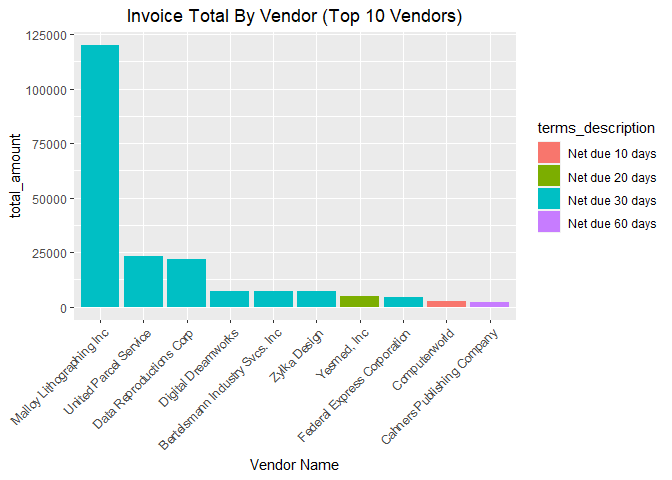
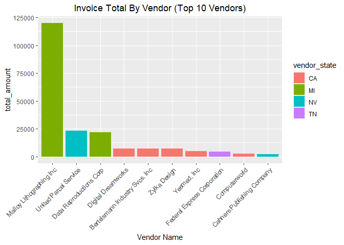
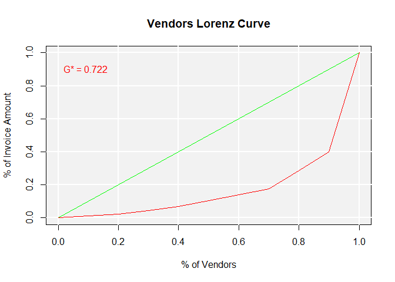
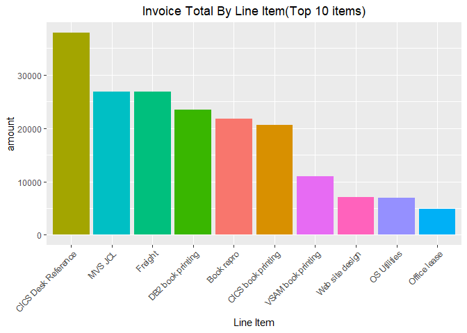
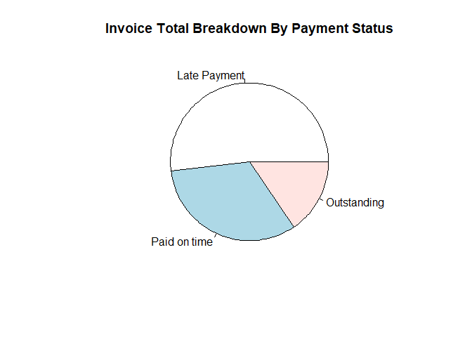

Accounts Payable Data Analysis using MySQL and R
================
By Njabulo Hlabangana

## Introduction

This one of my favorite projects for the simple reason that it involves
the use of two of my favorite data tools - R (markdown) and SQL. I
connected my MySQL database to R studio and used R markdown to run SQL
queries. The queries were then analysed and visualized using the ggplot2
package.

The MySQL database contains accounts payable data and was obtained from
Murach’s MySQL textbook resources that I have used a lot to learn SQL.

``` r
library(odbc)
library(RMySQL)
library(tidyverse)
library(ggeasy)
con = dbConnect(RMySQL::MySQL(),
                            dbname='ap',
                            host='localhost',
                            port=3306,
                            user='root',
                            password='Magalela@777')
```

## The AP database

The following line codes shows the list of tables in the ap database
that this analysis is based on.

``` r
dbListTables(con)
```

    ## [1] "general_ledger_accounts" "invoice_archive"        
    ## [3] "invoice_line_items"      "invoices"               
    ## [5] "terms"                   "vendor_contacts"        
    ## [7] "vendors"

This rather simple analysis is based on only 4 of the tables in the
database viz, invoices, vendors, terms and line_items.

### The Invoices Table

The line of SQL code below extracts the **invoices** table and saves it
as an R data frame named **invoices**

``` sql
SELECT *
FROM invoices
```

This is what the **invoices** table looks like after being converted to
an R dataframe.

``` r
head(invoices)
```

    ##   invoice_id vendor_id invoice_number invoice_date invoice_total payment_total
    ## 1          1       122     989319-457   2018-04-08       3813.33       3813.33
    ## 2          2       123      263253241   2018-04-10         40.20         40.20
    ## 3          3       123      963253234   2018-04-13        138.75        138.75
    ## 4          4       123     2-000-2993   2018-04-16        144.70        144.70
    ## 5          5       123      963253251   2018-04-16         15.50         15.50
    ## 6          6       123      963253261   2018-04-16         42.75         42.75
    ##   credit_total terms_id invoice_due_date payment_date
    ## 1            0        3       2018-05-08   2018-05-07
    ## 2            0        3       2018-05-10   2018-05-14
    ## 3            0        3       2018-05-13   2018-05-09
    ## 4            0        3       2018-05-16   2018-05-12
    ## 5            0        3       2018-05-16   2018-05-11
    ## 6            0        3       2018-05-16   2018-05-21

### The Vendors Table

The line extracts all the columns of the vendors table and saves them in
a dataframe named vendors

``` sql
SELECT *
FROM vendors
```

This is what the **vendors** table looks like as a data frame

``` r
head(vendors)
```

    ##   vendor_id                    vendor_name              vendor_address1
    ## 1         1              US Postal Service Attn:  Supt. Window Services
    ## 2         2  National Information Data Ctr                 PO Box 96621
    ## 3         3         Register of Copyrights          Library Of Congress
    ## 4         4                        Jobtrak   1990 Westwood Blvd Ste 260
    ## 5         5            Newbrige Book Clubs            3000 Cindel Drive
    ## 6         6 California Chamber Of Commerce               3255 Ramos Cir
    ##   vendor_address2 vendor_city vendor_state vendor_zip_code   vendor_phone
    ## 1     PO Box 7005     Madison           WI           53707 (800) 555-1205
    ## 2            <NA>  Washington           DC           20120 (301) 555-8950
    ## 3            <NA>  Washington           DC           20559           <NA>
    ## 4            <NA> Los Angeles           CA           90025 (800) 555-8725
    ## 5            <NA>  Washington           NJ           07882 (800) 555-9980
    ## 6            <NA>  Sacramento           CA           95827 (916) 555-6670
    ##   vendor_contact_last_name vendor_contact_first_name default_terms_id
    ## 1                  Alberto                 Francesco                1
    ## 2                    Irvin                      Ania                3
    ## 3                    Liana                     Lukas                3
    ## 4                    Quinn                    Kenzie                3
    ## 5                    Marks                  Michelle                4
    ## 6                    Mauro                     Anton                3
    ##   default_account_number
    ## 1                    552
    ## 2                    540
    ## 3                    403
    ## 4                    572
    ## 5                    394
    ## 6                    572

### The Terms Table

Now we extract the **terms** table from the database using a similar
line of SQL code.

``` sql
SELECT*
FROM terms
```

The **terms** table is shown below.

``` r
head(terms)
```

    ##   terms_id terms_description terms_due_days
    ## 1        1   Net due 10 days             10
    ## 2        2   Net due 20 days             20
    ## 3        3   Net due 30 days             30
    ## 4        4   Net due 60 days             60
    ## 5        5   Net due 90 days             90

## Analysis of Expenditure by Vendor, State & Credit Terms

The aim of the SQL querry below is to find the total value of all the
invoices in the accounts payable database. This total is broken down by
vendors and the credit terms they have for the organization. The results
of the query are saved in a data frame called M1_results.

``` sql
SELECT 
vendor_name, 
terms_description,
vendor_state,
sum(invoice_total) as total_amount

FROM
invoices i
JOIN vendors v
ON i.vendor_id = v.vendor_id
JOIN terms t
ON t.terms_id = i.terms_id 

GROUP BY vendor_name, terms_description, vendor_state
ORDER BY total_amount DESC
LIMIT 10
```

The first 6 rows of the M1_results are shown below.

``` r
head(M1_results)
```

    ##                      vendor_name terms_description vendor_state total_amount
    ## 1       Malloy Lithographing Inc   Net due 30 days           MI    119892.41
    ## 2          United Parcel Service   Net due 30 days           NV     23177.96
    ## 3        Data Reproductions Corp   Net due 30 days           MI     21927.31
    ## 4             Digital Dreamworks   Net due 30 days           CA      7125.34
    ## 5                   Zylka Design   Net due 30 days           CA      6940.25
    ## 6 Bertelsmann Industry Svcs. Inc   Net due 30 days           CA      6940.25

### Visualization of Expenditure By Vendor & Credit Terms

Only the top 10 vendors by total invoice value are shown in the graph
below. 7 out of those 10 offer 30 day payment terms. There is one
dominant vendor - Malloy Lithographing Inc. The total invoice amount for
this vendor is more than 5 times that of the second largest vendor.

``` r
ggplot(M1_results, aes(x = reorder(vendor_name,-total_amount), total_amount, fill = terms_description)) +
  geom_col()+
  xlab("Vendor Name")+
  labs(title = "Invoice Total By Vendor (Top 10 Vendors)")+
  ggeasy::easy_center_title()+
  theme(axis.text.x = element_text(angle = 45,hjust = 1))
```

<!-- -->

### Visualization of Expenditure By Vendor and Vendor State

Of the top 10 vendors, 5 are from the state of California. The combined
invoice total of these vendors is, however, less than the total of the
two vendors from the state of Miami which is where the dominant vendor
is located.

``` r
ggplot(M1_results, aes(x = reorder(vendor_name,-total_amount), total_amount, fill = vendor_state)) +
  geom_col()+
  xlab("Vendor Name")+
  labs(title = "Invoice Total By Vendor (Top 10 Vendors)")+
  ggeasy::easy_center_title()+
  theme(axis.text.x = element_text(angle = 45,hjust = 1))
```

<!-- -->

### An Economic Perspective On Supplier (vendor) Dominance

Seeing from the graphs above that the organization seems to be buying
mainly from a few vendors, I decided to ascertain the degree of
diversification of its vendor base. As someone with a background in
economics, I figured the **Gini Coefficient** would be a good indicator
to use. It is mainly used to measure the degree of income inequality in
society. It is also used in industrial organization and microeconomics
to estimate the degree of market concentration when studying market
structure.

The gini coefficient takes values between 0 and 1. A higher value
indicates high inequality. In the case of inequality measurement a high
value would indicate high inequality - a society in which income is
concentrated in the hands of a few people. In the case of market
structure study, a high value would be an indicator that a particular
market is dominated by a very few dominant players.

The Lorenz curve is used to display the distribution of invoice total
among vendors. The gini coefficient is also displayed on the curve.

``` r
library(REAT)
lorenz(M1_results$total_amount,lcx = "% of Vendors", lcy = "% of Invoice Amount",
       le.col = "green", lc.col = "red", lctitle = "Vendors Lorenz Curve", lcgn = TRUE )
```

<!-- -->

The high value of the gini coefficient **(0.722)** for this organization
shows that it is relying on a few vendors for its supplies. This may be
a risky arrangement because any supply chain disruptions that affect the
dominant vendors could have serous repercussions on its operations and
profitability.

## Line Item Analysis

The aim here is to breakdown invoice total value by line item in a bid
to understand how expenditure is spread among the items
(products/services)

``` sql
SELECT
line_item_description as line_item,
SUM(line_item_amount) as amount

FROM
invoice_line_items

GROUP BY line_item
ORDER BY amount DESC
LIMIT 10
```

``` r
head(line_items)
```

    ##             line_item   amount
    ## 1 CICS Desk Reference 37966.19
    ## 2             MVS JCL 26881.40
    ## 3             Freight 26835.53
    ## 4   DB2 book printing 23517.58
    ## 5          Book repro 21842.00
    ## 6  CICS book printing 20551.18

``` r
ggplot(line_items, aes(x = reorder(line_item,-amount), amount, fill = line_item)) +
  geom_col()+
  xlab("Line Item")+
  labs(title = "Invoice Total By Line Item(Top 10 items)")+
  ggeasy::easy_center_title()+
  theme(axis.text.x = element_text(angle = 45,hjust = 1),legend.position = "none")
```

<!-- -->

## Analysis of Invoice Payment Status

This part seeks to understand the payment status of invoices in the AP
database. The status is broken down into 3 categories with
self-explanatory titles - **Paid on Time, Late Payment and Outstanding
Payment**. The SQL code is shown below.

``` sql
SELECT 
sum(invoice_total) as amount,
CASE
    WHEN payment_date > invoice_due_date THEN "Late Payment"
    WHEN payment_date <= invoice_due_date THEN "Paid on time"
    ELSE "Outstanding"
END AS payment_status

FROM invoices
GROUP BY payment_status
ORDER BY amount DESC
```

## Payment Statement Visualization

The pie chart below visualizes the proportions of the different payment
statuses in the database.

``` r
head(Payment_Status)
```

    ##      amount payment_status
    ## 1 110986.56   Late Payment
    ## 2  70083.53   Paid on time
    ## 3  33220.42    Outstanding

``` r
pie(Payment_Status$amount,Payment_Status$payment_status, main = "Invoice Total Breakdown By Payment Status")
```

<!-- -->

This visualization indicates that the organization pays most of its
vendors late. This could be a cash-flow management strategy which could
potentially affect its relationship with its vendors.
