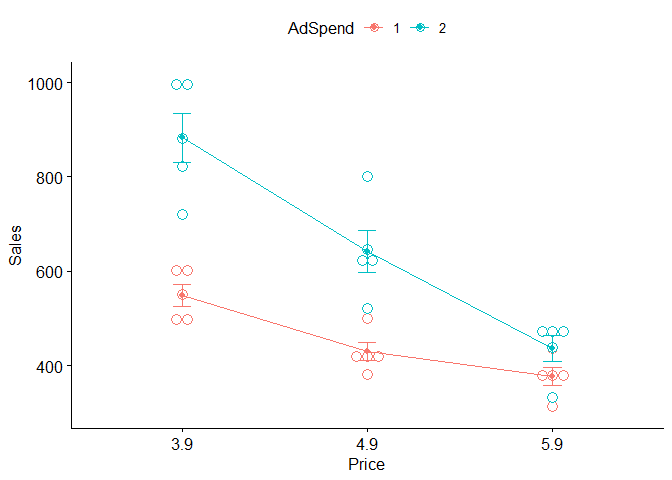

Marketing Effectiveness Study - Fruitazia
================
By Njabulo Hlabangana

## Introduction

The aim of this exercise is to assess the effectiveness of marketing
expenditure on the sales of an organization called Fruitazia using
standard statistical techniques like linear regression and analysis of
variance. The case study was part of the Marketing Analytics Course
offered by Columbia University on Edx. I took part in the auditing track
of the course.

## Loading the requisite packages

``` r
library(tidyverse)
library(ggpubr) #anova visualization
```

## Loading the data

The data presents results of a market test for fruit juice with 2
advertising levels × 3 price levels, which gives 6 experimental
conditions, with 5 supermarkets per condition.

``` r
fruitazia <- readxl::read_excel("C:/Users/hlaba/Desktop/Marketing/fruitazia.xlsx")
fruitazia$Price <- as.factor(fruitazia$Price) # converting price to a factor 
fruitazia$AdSpend <- as.factor(fruitazia$AdSpend) # converting AdSpend into a factor

fruitazia
```

    ## # A tibble: 30 × 6
    ##    Sales Price AdSpend AdSpend2 Price4.9 Price5.9
    ##    <dbl> <fct> <fct>      <dbl>    <dbl>    <dbl>
    ##  1   499 3.9   1              0        0        0
    ##  2   595 3.9   1              0        0        0
    ##  3   496 3.9   1              0        0        0
    ##  4   607 3.9   1              0        0        0
    ##  5   550 3.9   1              0        0        0
    ##  6   989 3.9   2              1        0        0
    ##  7   721 3.9   2              1        0        0
    ##  8   823 3.9   2              1        0        0
    ##  9  1001 3.9   2              1        0        0
    ## 10   881 3.9   2              1        0        0
    ## # … with 20 more rows

In the data, each out of 30 rows encodes experiment description per
supermarket, including set price and advertising expenditure as well as
the resulting sales. Sales are in thousands of cases. Price is in
dollars. Ad spend is in million dollars. The rest of the variables are
dummies encoding distinct price, ad spend levels, and their
interactions.

## Data summary

The code below shows the mean sales for each price level and associated
ad spending.

``` r
library(knitr)
library(kableExtra)
kable(aggregate(Sales ~ Price + AdSpend, data=fruitazia, FUN=mean))
```

<table>
<thead>
<tr>
<th style="text-align:left;">
Price
</th>
<th style="text-align:left;">
AdSpend
</th>
<th style="text-align:right;">
Sales
</th>
</tr>
</thead>
<tbody>
<tr>
<td style="text-align:left;">
3.9
</td>
<td style="text-align:left;">
1
</td>
<td style="text-align:right;">
549.4
</td>
</tr>
<tr>
<td style="text-align:left;">
4.9
</td>
<td style="text-align:left;">
1
</td>
<td style="text-align:right;">
430.2
</td>
</tr>
<tr>
<td style="text-align:left;">
5.9
</td>
<td style="text-align:left;">
1
</td>
<td style="text-align:right;">
377.4
</td>
</tr>
<tr>
<td style="text-align:left;">
3.9
</td>
<td style="text-align:left;">
2
</td>
<td style="text-align:right;">
883.0
</td>
</tr>
<tr>
<td style="text-align:left;">
4.9
</td>
<td style="text-align:left;">
2
</td>
<td style="text-align:right;">
642.6
</td>
</tr>
<tr>
<td style="text-align:left;">
5.9
</td>
<td style="text-align:left;">
2
</td>
<td style="text-align:right;">
436.8
</td>
</tr>
</tbody>
</table>

The results of the test are depicted graphically below. The general
observation is that sales tend to go down as prices go increases. This
is basically micro-economics 101. Also, for any given price level, more
advertising expenditure tends to generate higher sales.This is shown by
the 2 million dollar AdSpend curve being above the 1 million dollar one
at all levels of the price factor.

``` r
ggline(fruitazia, x = "Price", y = "Sales", color = "AdSpend",
       add = c("mean_se", "dotplot"))
```

<!-- -->

## Statistical Analysis

The descriptive analysis above points to a significant effect of both
price and advertisement spending on sales. The question, however, is
whether or not the effect is statistically significant and this section
seeks to answer that question.

**One-way Analysis of Variance** (ANOVA) will be used first. The *lm()*
function is used to ascertain the significance of the all the factor
levels which are encoded as dummy variables. All the factor levels are
statistically significant at the 0.1% level of significance.

``` r
model <- lm(Sales ~ Price + AdSpend, data=fruitazia)
summary(model)
```

    ## 
    ## Call:
    ## lm(formula = Sales ~ Price + AdSpend, data = fruitazia)
    ## 
    ## Residuals:
    ##     Min      1Q  Median      3Q     Max 
    ## -176.00  -50.38   -7.40   64.35  183.90 
    ## 
    ## Coefficients:
    ##             Estimate Std. Error t value Pr(>|t|)    
    ## (Intercept)   615.30      34.39  17.893 3.89e-16 ***
    ## Price4.9     -179.80      42.12  -4.269 0.000231 ***
    ## Price5.9     -309.10      42.12  -7.339 8.56e-08 ***
    ## AdSpend2      201.80      34.39   5.868 3.46e-06 ***
    ## ---
    ## Signif. codes:  0 '***' 0.001 '**' 0.01 '*' 0.05 '.' 0.1 ' ' 1
    ## 
    ## Residual standard error: 94.17 on 26 degrees of freedom
    ## Multiple R-squared:  0.7735, Adjusted R-squared:  0.7474 
    ## F-statistic: 29.59 on 3 and 26 DF,  p-value: 1.537e-08

The analysis above shows the effect of the individual levels of the
Price and AdSpend factor levels but does not quite indicate the overall
effects of the Price and AdSpend factors. Calling the *ANOVA()* function
helps with that as used below.

``` r
anova(model)
```

    ## Analysis of Variance Table
    ## 
    ## Response: Sales
    ##           Df Sum Sq Mean Sq F value    Pr(>F)    
    ## Price      2 481964  240982  27.172 4.268e-07 ***
    ## AdSpend    1 305424  305424  34.439 3.459e-06 ***
    ## Residuals 26 230585    8869                      
    ## ---
    ## Signif. codes:  0 '***' 0.001 '**' 0.01 '*' 0.05 '.' 0.1 ' ' 1

The anova analysis confirms the overall statistical significance of both
Price and AdSpend factors. They are both significant at the 0.1% level.

## ANOVA with Interaction

A quick look at the graphical depiction of the effect of AdSpend shown
in the graph above shows that the effect of AdSpend gets lower as the
price increases. This is shown by the shrinking of the space between the
two lines as the price level increases and can be an indicator of the
possible interaction between Price and AdSpend. If AdSpend affected
Sales the same way across all Price levels, the gap between the two
lines in the graph would be more or less constant - the two lines would
be parallel.

It therefore necessary to conduct a statistical test to check for the
possible statistical significance of this interaction as done below.

``` r
model_interaction <- lm(Sales ~ Price * AdSpend, data=fruitazia)
summary(model_interaction)
```

    ## 
    ## Call:
    ## lm(formula = Sales ~ Price * AdSpend, data = fruitazia)
    ## 
    ## Residuals:
    ##     Min      1Q  Median      3Q     Max 
    ## -162.00  -43.80    0.20   39.45  157.40 
    ## 
    ## Coefficients:
    ##                   Estimate Std. Error t value Pr(>|t|)    
    ## (Intercept)         549.40      33.69  16.309 1.73e-14 ***
    ## Price4.9           -119.20      47.64  -2.502 0.019565 *  
    ## Price5.9           -172.00      47.64  -3.610 0.001401 ** 
    ## AdSpend2            333.60      47.64   7.002 3.06e-07 ***
    ## Price4.9:AdSpend2  -121.20      67.37  -1.799 0.084625 .  
    ## Price5.9:AdSpend2  -274.20      67.37  -4.070 0.000442 ***
    ## ---
    ## Signif. codes:  0 '***' 0.001 '**' 0.01 '*' 0.05 '.' 0.1 ' ' 1
    ## 
    ## Residual standard error: 75.33 on 24 degrees of freedom
    ## Multiple R-squared:  0.8662, Adjusted R-squared:  0.8384 
    ## F-statistic: 31.08 on 5 and 24 DF,  p-value: 9.777e-10

The effect of interaction effect is negative and statistically
significant at the 5% level only for the highest price of $5.9 per unit.
This corroborates the graphical analysis finding that Adspend is less
effective at higher higher prices.
